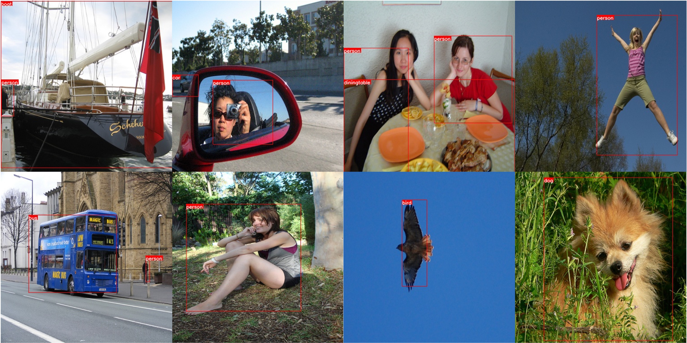
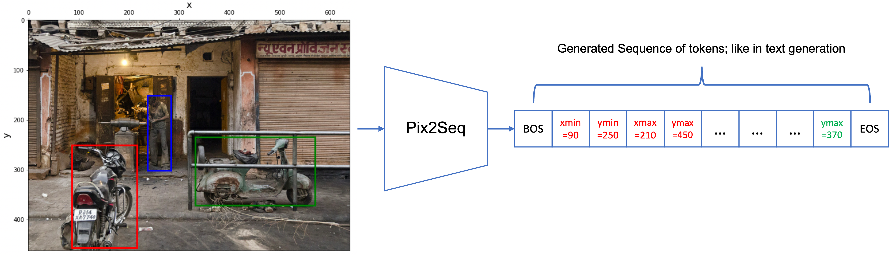
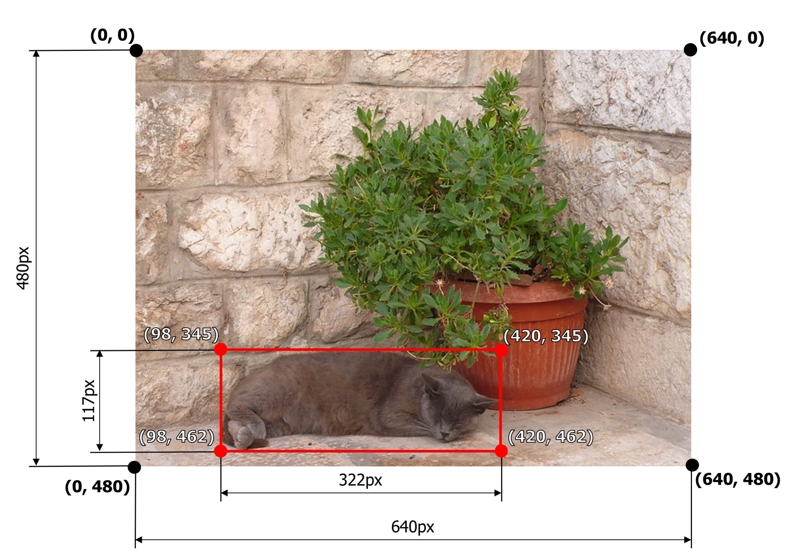

# Easy Object Detection with Transformers: Simple Implementation of Pix2Seq model in PyTorch


# Introduction

[](https://colab.research.google.com/drive/1UeYIZ6_GHNwCHSi8nNV5dVc3oUrM5-BA?usp=sharing)

[](https://www.kaggle.com/code/moeinshariatnia/object-detection-w-transformers-pix2seq-pytorch/notebook)

You can also read this tutorial on [Towards AI](https://pub.towardsai.net/easy-object-detection-with-transformers-simple-implementation-of-pix2seq-model-in-pytorch-fde3e7162ce7)

Object detection does not have to be a difficult task! I clearly remember the first time I implemented YOLO from scratch and it was a pain to understand how it works under the hood. For the beginners in computer vision applications, I believe that object detection is the hardest one to understand among classification, segmentation, and etc.

Once I first heard about the paper "[Pix2seq: A Language Modeling Framework for Object Detection](https://arxiv.org/abs/2109.10852)" , I got pretty damn excited and I was sure my next blog post will be about it; so, here I am writing this post and hoping that you'll like it and find the pix2seq model easy to understand and implement.

At the end of this tutorial, you'll learn to implement a simple model for object detection which produces the following results:




# Run locally
### You can use this repo locally with the following commands. Ignore this if you want to continue with the tutorial (the rest of the tutorial is down below).
Run the following to download the dataset, install the dependencies, and then start training.
```bash
./download_data.sh
pip install -r requirements.txt
python train.py
```

You can also test the model on your own images with the following command:
```bash
./download_weights.sh
python infer_single_image.py --image './VOCdevkit/VOC2012/JPEGImages/2012_000947.jpg'
```

## Please cite this repo if it helped you.
```
@software{Shariatnia_Pix2Seq-pytorch_2022,
author = {Shariatnia, M. Moein},
doi = {10.5281/zenodo.7010778},
month = {8},
title = {{Pix2Seq-pytorch}},
version = {1.0.0},
year = {2022}
}
```
[](https://zenodo.org/badge/latestdoi/525892539)

# Continue of the Tutorial
## What's interesting about this paper

The idea is pretty simple: Reframe the object detection problem as a task of text (token) generation! We want the model to "tell us" what objects exist in the image and also the (x, y) coordinates of their bounding boxes (bboxes), all in a specific format in the generated sequence; just like text generation!



As you see, the object detection task is transformed to an image-captioning-ish task: describe the image in text (sequence) but this time tell us exactly where the objects are.

# Pix2Seq: Simple Implementation


## Needed Modules

The closest task to what Pix2Seq does is image-captioning. So, we are going to need an image encoder to convert an image into vectors of hidden representation and then a decoder to take the image representations and those of the previously generated tokens and predict the next token. We also need a tokenizer to convert object classes and coordinates into tokens that form their special vocabulary; just like the words in a natural language.

## My Simple Implementation of Pix2Seq


You can see the high level pipeline of this project in the picture above. As you see, we need a dataset of images and their bboxes for which we will use Pascal VOC 2012 dataset. Next, we will write our own tokenizer from scratch to convert the bbox classes and coordinates into a sequence of tokens. Then, we will use DeiT [(from this paper)](https://arxiv.org/abs/2012.12877) as our image encoder and feed the image embeddings to a vanilla Transformer Decoder [(from this paper)](https://arxiv.org/abs/1706.03762?amp=1). The decoder's task is to predict the next token given the previous ones. The outputs of the decoder are given to the language modeling loss function.

# Installation


```python
!pip install timm -q
!pip install transformers -q
```

# Imports


```python
import gc
import os
import cv2
import math
import random
from glob import glob
import numpy as np
import pandas as pd
from functools import partial
from tqdm.autonotebook import tqdm
import matplotlib.pyplot as plt

import albumentations as A
import xml.etree.ElementTree as ET
from sklearn.model_selection import StratifiedGroupKFold

import torch
from torch import nn
import torch.nn.functional as F
from torch.nn.utils.rnn import pad_sequence

import timm
from timm.models.layers import trunc_normal_

import transformers
from transformers import top_k_top_p_filtering
from transformers import get_linear_schedule_with_warmup
```


```python
def seed_everything(seed=1234):
    random.seed(seed)
    os.environ['PYTHONHASHSEED'] = str(seed)
    np.random.seed(seed)
    torch.manual_seed(seed)
    torch.cuda.manual_seed(seed)
    torch.backends.cudnn.deterministic = True
seed_everything(seed=42)
```

# Config

This will be where we store the most important variables in order to have a quick access to them.


```python
class CFG:
    img_path = "/content/VOCdevkit/VOC2012/JPEGImages"
    xml_path =  "/content/VOCdevkit/VOC2012/Annotations"
    device = torch.device('cuda' if torch.cuda.is_available() else 'cpu')
    
    max_len = 300
    img_size = 384
    num_bins = img_size
    
    batch_size = 16
    epochs = 10
    
    model_name = 'deit3_small_patch16_384_in21ft1k'
    num_patches = 576
    lr = 1e-4
    weight_decay = 1e-4

    generation_steps = 101
```

# Download and Extract data


```python
!wget -O "/content/trainval.tar" "http://host.robots.ox.ac.uk/pascal/VOC/voc2012/VOCtrainval_11-May-2012.tar"
```

    --2022-08-19 14:54:00--  http://host.robots.ox.ac.uk/pascal/VOC/voc2012/VOCtrainval_11-May-2012.tar
    Resolving host.robots.ox.ac.uk (host.robots.ox.ac.uk)... 129.67.94.152
    Connecting to host.robots.ox.ac.uk (host.robots.ox.ac.uk)|129.67.94.152|:80... connected.
    HTTP request sent, awaiting response... 200 OK
    Length: 1999639040 (1.9G) [application/x-tar]
    Saving to: ‘/content/trainval.tar’
    
    /content/trainval.t 100%[===================>]   1.86G  14.2MB/s    in 2m 16s  
    
    2022-08-19 14:56:17 (14.0 MB/s) - ‘/content/trainval.tar’ saved [1999639040/1999639040]
    


```python
!tar -xvf "/content/trainval.tar" > /dev/null
```


```python
IMG_FILES = glob(CFG.img_path + "/*.jpg")
XML_FILES = glob(CFG.xml_path + "/*.xml")
len(XML_FILES), len(IMG_FILES)
```


    (17125, 17125)


## Process XML files and build the dataframe


```python
class XMLParser:
    def __init__(self,xml_file):

        self.xml_file = xml_file
        self._root = ET.parse(self.xml_file).getroot()
        self._objects = self._root.findall("object")
        # path to the image file as describe in the xml file
        self.img_path = os.path.join(CFG.img_path, self._root.find('filename').text)
        # image id 
        self.image_id = self._root.find("filename").text
        # names of the classes contained in the xml file
        self.names = self._get_names()
        # coordinates of the bounding boxes
        self.boxes = self._get_bndbox()

    def parse_xml(self):
        """"Parse the xml file returning the root."""
    
        tree = ET.parse(self.xml_file)
        return tree.getroot()

    def _get_names(self):

        names = []
        for obj in self._objects:
            name = obj.find("name")
            names.append(name.text)

        return np.array(names)

    def _get_bndbox(self):

        boxes = []
        for obj in self._objects:
            coordinates = []
            bndbox = obj.find("bndbox")
            coordinates.append(np.int32(bndbox.find("xmin").text))
            coordinates.append(np.int32(np.float32(bndbox.find("ymin").text)))
            coordinates.append(np.int32(bndbox.find("xmax").text))
            coordinates.append(np.int32(bndbox.find("ymax").text))
            boxes.append(coordinates)

        return np.array(boxes)

def xml_files_to_df(xml_files):
    
    """"Return pandas dataframe from list of XML files."""
    
    names = []
    boxes = []
    image_id = []
    xml_path = []
    img_path = []
    for f in xml_files:
        xml = XMLParser(f)
        names.extend(xml.names)
        boxes.extend(xml.boxes)
        image_id.extend([xml.image_id] * len(xml.names))
        xml_path.extend([xml.xml_file] * len(xml.names))
        img_path.extend([xml.img_path] * len(xml.names))
    a = {"image_id": image_id,
         "names": names,
         "boxes": boxes,
         "xml_path":xml_path,
         "img_path":img_path}
    
    df = pd.DataFrame.from_dict(a, orient='index')
    df = df.transpose()
    
    df['xmin'] = -1
    df['ymin'] = -1
    df['xmax'] = -1
    df['ymax'] = -1

    df[['xmin','ymin','xmax','ymax']] = np.stack([df['boxes'][i] for i in range(len(df['boxes']))])

    df.drop(columns=['boxes'], inplace=True)
    df['xmin'] = df['xmin'].astype('float32')
    df['ymin'] = df['ymin'].astype('float32')
    df['xmax'] = df['xmax'].astype('float32')
    df['ymax'] = df['ymax'].astype('float32')
    
    df['id'] = df['image_id'].map(lambda x: x.split(".jpg")[0])
    
    return df

def build_df(xml_files):
    # parse xml files and create pandas dataframe
    df = xml_files_to_df(xml_files)
    

    classes = sorted(df['names'].unique())
    cls2id = {cls_name: i for i, cls_name in enumerate(classes)}
    df['label'] = df['names'].map(cls2id)
    
    # in this df, each object of a given image is in a separate row
    df = df[['id', 'label', 'xmin', 'ymin', 'xmax', 'ymax', 'img_path']]
    
    return df, classes
```


```python
df, classes = build_df(XML_FILES)
cls2id = {cls_name: i for i, cls_name in enumerate(classes)}
id2cls = {i: cls_name for i, cls_name in enumerate(classes)}

print(len(classes))
df.head()
```

    20


<table border="1" class="dataframe">
  <thead>
    <tr style="text-align: right;">
      <th></th>
      <th>id</th>
      <th>label</th>
      <th>xmin</th>
      <th>ymin</th>
      <th>xmax</th>
      <th>ymax</th>
      <th>img_path</th>
    </tr>
  </thead>
  <tbody>
    <tr>
      <th>0</th>
      <td>2010_000981</td>
      <td>0</td>
      <td>59.0</td>
      <td>108.0</td>
      <td>462.0</td>
      <td>241.0</td>
      <td>/content/VOCdevkit/VOC2012/JPEGImages/2010_000...</td>
    </tr>
    <tr>
      <th>1</th>
      <td>2012_002880</td>
      <td>14</td>
      <td>55.0</td>
      <td>21.0</td>
      <td>94.0</td>
      <td>120.0</td>
      <td>/content/VOCdevkit/VOC2012/JPEGImages/2012_002...</td>
    </tr>
    <tr>
      <th>2</th>
      <td>2012_002880</td>
      <td>14</td>
      <td>241.0</td>
      <td>30.0</td>
      <td>274.0</td>
      <td>109.0</td>
      <td>/content/VOCdevkit/VOC2012/JPEGImages/2012_002...</td>
    </tr>
    <tr>
      <th>3</th>
      <td>2012_002880</td>
      <td>14</td>
      <td>451.0</td>
      <td>18.0</td>
      <td>476.0</td>
      <td>97.0</td>
      <td>/content/VOCdevkit/VOC2012/JPEGImages/2012_002...</td>
    </tr>
    <tr>
      <th>4</th>
      <td>2011_001526</td>
      <td>8</td>
      <td>426.0</td>
      <td>147.0</td>
      <td>500.0</td>
      <td>294.0</td>
      <td>/content/VOCdevkit/VOC2012/JPEGImages/2011_001...</td>
    </tr>
  </tbody>
</table>
</div>

## Split dataframe to train and validation sets


```python
def split_df(df, n_folds=5, training_fold=0):
    mapping = df.groupby("id")['img_path'].agg(len).to_dict()
    df['stratify'] = df['id'].map(mapping)

    kfold = StratifiedGroupKFold(
        n_splits=n_folds, shuffle=True, random_state=42)

    for i, (_, val_idx) in enumerate(kfold.split(df, y=df['stratify'], groups=df['id'])):
        df.loc[val_idx, 'fold'] = i

    train_df = df[df['fold'] != training_fold].reset_index(drop=True)
    valid_df = df[df['fold'] == training_fold].reset_index(drop=True)

    return train_df, valid_df
```


```python
train_df, valid_df = split_df(df)
print("Train size: ", train_df['id'].nunique())
print("Valid size: ", valid_df['id'].nunique())
```

    Train size:  13700
    Valid size:  3425


# Building Dataset and Data Loaders

As I mentioned earlier, we will use VOC 2012 dataset with 17125 images and their corresponding objects from 20 classes. The paper uses COCO dataset which is an order of magnitude larger than VOC and they also pre-train the models on a much larger dataset before training on COCO. But, to stay simple, I'm gonna use this rather small VOC dataset.

```python
classes = [
  "aeroplane", "bicycle", "bird", "boat", "bottle", 
  "bus", "car", "cat", "chair", "cow", 
  "diningtable", "dog", "horse", "motorbike", "person"
  "pottedplant", "sheep", "sofa", "train", "tvmonitor"
]
```


```python
def get_transform_train(size):
    return A.Compose([
        A.HorizontalFlip(p=0.5),
        A.RandomBrightnessContrast(p=0.2),
        A.Resize(size, size),
        A.Normalize(),
    ], bbox_params={'format': 'pascal_voc', 'label_fields': ['labels']})


def get_transform_valid(size):
    return A.Compose([
        A.Resize(size, size),
        A.Normalize(),
    ], bbox_params={'format': 'pascal_voc', 'label_fields': ['labels']})
```

We need a PyTorch dataset class that gives us an image and its bbox coordinates and classes in form of a sequence.


```python
class VOCDataset(torch.utils.data.Dataset):
    def __init__(self, df, transforms=None, tokenizer=None):
        self.ids = df['id'].unique()
        self.df = df
        self.transforms = transforms
        self.tokenizer = tokenizer

    def __getitem__(self, idx):
        sample = self.df[self.df['id'] == self.ids[idx]]
        img_path = sample['img_path'].values[0]

        img = cv2.imread(img_path)[..., ::-1]
        labels = sample['label'].values
        bboxes = sample[['xmin', 'ymin', 'xmax', 'ymax']].values

        if self.transforms is not None:
            transformed = self.transforms(**{
                'image': img,
                'bboxes': bboxes,
                'labels': labels
            })
            img = transformed['image']
            bboxes = transformed['bboxes']
            labels = transformed['labels']

        img = torch.FloatTensor(img).permute(2, 0, 1)

        if self.tokenizer is not None:
            seqs = self.tokenizer(labels, bboxes)
            seqs = torch.LongTensor(seqs)
            return img, seqs

        return img, labels, bboxes

    def __len__(self):
        return len(self.ids)
```

As you see, most of the code here is what you expect from a simple dataset for classification but there are small differences too. We need a Tokenizer to convert our labels and bbox coordinates (x and y) to a sequence so that we can perform train our model for the language modeling task (predicting the next tokens conditioned on the previously seen tokens).

## Tokenizer

How are we going to convert these information into a sequence? Well, it's not that difficult. To represent an object in an image, we need 5 numbers: 4 coordinate numbers and 1 to indicate which class it belongs to. 
You actually need to know the coordinates of 2 points of a bounding box to be able to draw it in an image; in pascal format, we use the top left point and the bottom right point of the bbox as those 2 critical points and each point is represented by its x and y values → so, we will need 4 numbers overall to draw a bounding box. You can see alternative formats to represent a bounding box down below. Also, look at where the start of x and y axis is (the 0, 0 point).



As you see in the dataset's code, we give the bbox coordinates and labels to our tokenizer and get a simple list of tokens out. The tokenizer needs to do the following tasks:
1. mark the start and end of the sequence w/ especial tokens (BOS and EOS tokens).
2. quantize the continuous value of coordinates (we can have x=34.7 as the coordinate of a point but we need discrete values like 34 as our tokens because we are finally doing a classification on a finite set of tokens)
3. encode the label of the objects into their corresponding tokens
4. randomize the order of objects in the final sequence (more on this below)

If you are familiar with NLP applications, these steps might sound familiar to you as they are also done when we are dealing with words in a natural language; we need to tokenize them and assign each word to its own discrete token, mark the start and end of the sequence, etc.
Regarding the number 4 in this list, this is what the paper does and there is an extensive ablation study on whether it is a good idea. What it says is that each time that we show the same image to the model (in different epochs), we randomize the order in which the objects appear in the corresponding sequence which we feed to the model (with one token shifted) and our loss function. For example, if there is a "person", a "car", and a "cat" in an image, the tokenizer and dataset will put these objects in random order in the sequence: 
- BOS, car_xmin, car_ymin, car_xmax, car_ymax, car_label, person_xmin, person_ymin, person_xmax, person_ymax, person_label, cat_xmin, cat_ymin, cat_xmax, cat_ymax, cat_label, EOS
- BOS, person_xmin, person_ymin, person_xmax, person_ymax, person_label, car_xmin, car_ymin, car_xmax, car_ymax, car_label, cat_xmin, cat_ymin, cat_xmax, cat_ymax, cat_label, EOS
- …


```python
class Tokenizer:
    def __init__(self, num_classes: int, num_bins: int, width: int, height: int, max_len=500):
        self.num_classes = num_classes
        self.num_bins = num_bins
        self.width = width
        self.height = height
        self.max_len = max_len

        self.BOS_code = num_classes + num_bins
        self.EOS_code = self.BOS_code + 1
        self.PAD_code = self.EOS_code + 1

        self.vocab_size = num_classes + num_bins + 3

    def quantize(self, x: np.array):
        """
        x is a real number in [0, 1]
        """
        return (x * (self.num_bins - 1)).astype('int')
    
    def dequantize(self, x: np.array):
        """
        x is an integer between [0, num_bins-1]
        """
        return x.astype('float32') / (self.num_bins - 1)

    def __call__(self, labels: list, bboxes: list, shuffle=True):
        assert len(labels) == len(bboxes), "labels and bboxes must have the same length"
        bboxes = np.array(bboxes)
        labels = np.array(labels)
        labels += self.num_bins
        labels = labels.astype('int')[:self.max_len]

        bboxes[:, 0] = bboxes[:, 0] / self.width
        bboxes[:, 2] = bboxes[:, 2] / self.width
        bboxes[:, 1] = bboxes[:, 1] / self.height
        bboxes[:, 3] = bboxes[:, 3] / self.height

        bboxes = self.quantize(bboxes)[:self.max_len]

        if shuffle:
            rand_idxs = np.arange(0, len(bboxes))
            np.random.shuffle(rand_idxs)
            labels = labels[rand_idxs]
            bboxes = bboxes[rand_idxs]

        tokenized = [self.BOS_code]
        for label, bbox in zip(labels, bboxes):
            tokens = list(bbox)
            tokens.append(label)

            tokenized.extend(list(map(int, tokens)))
        tokenized.append(self.EOS_code)

        return tokenized    
    
    def decode(self, tokens: torch.tensor):
        """
        toekns: torch.LongTensor with shape [L]
        """
        mask = tokens != self.PAD_code
        tokens = tokens[mask]
        tokens = tokens[1:-1]
        assert len(tokens) % 5 == 0, "invalid tokens"

        labels = []
        bboxes = []
        for i in range(4, len(tokens)+1, 5):
            label = tokens[i]
            bbox = tokens[i-4: i]
            labels.append(int(label))
            bboxes.append([int(item) for item in bbox])
        labels = np.array(labels) - self.num_bins
        bboxes = np.array(bboxes)
        bboxes = self.dequantize(bboxes)
        
        bboxes[:, 0] = bboxes[:, 0] * self.width
        bboxes[:, 2] = bboxes[:, 2] * self.width
        bboxes[:, 1] = bboxes[:, 1] * self.height
        bboxes[:, 3] = bboxes[:, 3] * self.height
        
        return labels, bboxes
```

Another note on how to quantize the continuous values of coordinates: imagine that the image size is 224. You can have a bbox with these 4 coordinates (12.2, 35.8, 68.1, 120.5). 
You will need at least 224 tokens (num_bins) to be able to tokenize (quantize) these 4 numbers with a precision of 1 pixel (you will lose information below 1 pixel). As you see in the tokenizer code, to convert this bbox coordinates to their tokenized version, we need to do the following:
1. normalize the coordinates (make them between 0 and 1 by dividing them by the max value = 224)
2. do this: ```int(x * (num_bins-1))```

so, the converted version will be: (12, 35, 67, 119). Remember that int() function in Python does not round the number to the closest integer, but it will keep only the integer part of the number. As you see, we have lost some information on the exact position of the bbox but it is still a very good approximation. We can use a larger number of tokens (num of bins, as stated in the paper) and we will have a more precise location. Our tokenizer also has decode() function which we will use to convert sequences into bbox coordinates and labels.


```python
tokenizer = Tokenizer(num_classes=len(classes), num_bins=CFG.num_bins,
                          width=CFG.img_size, height=CFG.img_size, max_len=CFG.max_len)
CFG.pad_idx = tokenizer.PAD_code
```

## Collate Function

Here, we will implement a custom collate_function to give to our PyTorch data loader. This function will take care of Padding for us: to make all the sequences the same length by adding PAD_IDX to the shorter ones in order to be able to build a batch with them. We are going to pad the sequence to a fixed max length of 300 tokens.


```python
def collate_fn(batch, max_len, pad_idx):
    """
    if max_len:
        the sequences will all be padded to that length
    """
    image_batch, seq_batch = [], []
    for image, seq in batch:
        image_batch.append(image)
        seq_batch.append(seq)

    seq_batch = pad_sequence(
        seq_batch, padding_value=pad_idx, batch_first=True)
    if max_len:
        pad = torch.ones(seq_batch.size(0), max_len -
                         seq_batch.size(1)).fill_(pad_idx).long()
        seq_batch = torch.cat([seq_batch, pad], dim=1)
    image_batch = torch.stack(image_batch)
    return image_batch, seq_batch
```


```python
def get_loaders(train_df, valid_df, tokenizer, img_size, batch_size, max_len, pad_idx, num_workers=2):

    train_ds = VOCDataset(train_df, transforms=get_transform_train(
        img_size), tokenizer=tokenizer)

    trainloader = torch.utils.data.DataLoader(
        train_ds,
        batch_size=batch_size,
        shuffle=True,
        collate_fn=partial(collate_fn, max_len=max_len, pad_idx=pad_idx),
        num_workers=num_workers,
        pin_memory=True,
    )

    valid_ds = VOCDataset(valid_df, transforms=get_transform_valid(
        img_size), tokenizer=tokenizer)

    validloader = torch.utils.data.DataLoader(
        valid_ds,
        batch_size=batch_size,
        shuffle=False,
        collate_fn=partial(collate_fn, max_len=max_len, pad_idx=pad_idx),
        num_workers=2,
        pin_memory=True,
    )

    return trainloader, validloader
```


```python
train_loader, valid_loader = get_loaders(
        train_df, valid_df, tokenizer, CFG.img_size, CFG.batch_size, CFG.max_len, tokenizer.PAD_code)
```

# Models

Finally arrived to the coolest part for every deep learning lover: The Model 😍
Let's take a second look at the first image of this tutorial. First, we will need an encoder to take the input image and give us some embeddings (representations). The paper uses a ResNet50 (and also in other experiments uses ViT) but I decided to use DeiT. As the name suggests, this is a data efficient vision transformer and I thought it would be a good fit for our small dataset. Like ViT, it splits the image into patches and processes them like words in a sentence which again could be great for our task, as we will have a separate embedding for each of these patches and we can give them to our decoder in the next section to predict the target sequence (see it like translation from English to French, where our image is like a sentence in English and our target sequence containing the coordinates and labels of bboxes is like the equivalent sentence in French).
I will use timm library to implement a pre-trained DeiT model.


```python
class Encoder(nn.Module):
    def __init__(self, model_name='deit3_small_patch16_384_in21ft1k', pretrained=False, out_dim=256):
        super().__init__()
        self.model = timm.create_model(
            model_name, num_classes=0, global_pool='', pretrained=pretrained)
        self.bottleneck = nn.AdaptiveAvgPool1d(out_dim)

    def forward(self, x):
        features = self.model(x)
        return self.bottleneck(features[:, 1:])
```

The bottleneck layer is to reduce the number of features of these embeddings to that of the decoder. The paper used a decoder dim of 256 and that's the reason why I am reducing it here using Average Pooling. Also, the first token in this model relates to the CLS token and I am skipping it in the forward method (```features[:, 1:]```).


```python
class Decoder(nn.Module):
    def __init__(self, vocab_size, encoder_length, dim, num_heads, num_layers):
        super().__init__()
        self.dim = dim
        
        self.embedding = nn.Embedding(vocab_size, dim)
        self.decoder_pos_embed = nn.Parameter(torch.randn(1, CFG.max_len-1, dim) * .02)
        self.decoder_pos_drop = nn.Dropout(p=0.05)
        
        decoder_layer = nn.TransformerDecoderLayer(d_model=dim, nhead=num_heads)
        self.decoder = nn.TransformerDecoder(decoder_layer, num_layers=num_layers)
        self.output = nn.Linear(dim, vocab_size)
        
        
        self.encoder_pos_embed = nn.Parameter(torch.randn(1, encoder_length, dim) * .02)
        self.encoder_pos_drop = nn.Dropout(p=0.05)
        
        self.init_weights()
        
    def init_weights(self):
        for name, p in self.named_parameters():
            if 'encoder_pos_embed' in name or 'decoder_pos_embed' in name: 
                print("skipping pos_embed...")
                continue
            if p.dim() > 1:
                nn.init.xavier_uniform_(p)
                
        trunc_normal_(self.encoder_pos_embed, std=.02)
        trunc_normal_(self.decoder_pos_embed, std=.02)
        
    
    def forward(self, encoder_out, tgt):
        """
        encoder_out: shape(N, L, D)
        tgt: shape(N, L)
        """
        
        tgt_mask, tgt_padding_mask = create_mask(tgt)
        tgt_embedding = self.embedding(tgt)
        tgt_embedding = self.decoder_pos_drop(
            tgt_embedding + self.decoder_pos_embed
        )
        
        encoder_out = self.encoder_pos_drop(
            encoder_out + self.encoder_pos_embed
        )
        
        encoder_out = encoder_out.transpose(0, 1)
        tgt_embedding = tgt_embedding.transpose(0, 1)
        
        preds = self.decoder(memory=encoder_out, 
                             tgt=tgt_embedding,
                             tgt_mask=tgt_mask, 
                             tgt_key_padding_mask=tgt_padding_mask)
        
        preds = preds.transpose(0, 1)
        return self.output(preds)
    
    def predict(self, encoder_out, tgt):
        length = tgt.size(1)
        padding = torch.ones(tgt.size(0), CFG.max_len-length-1).fill_(CFG.pad_idx).long().to(tgt.device)
        tgt = torch.cat([tgt, padding], dim=1)
        tgt_mask, tgt_padding_mask = create_mask(tgt)
        # is it necessary to multiply it by math.sqrt(d) ?
        tgt_embedding = self.embedding(tgt)
        tgt_embedding = self.decoder_pos_drop(
            tgt_embedding + self.decoder_pos_embed
        )
        
        encoder_out = self.encoder_pos_drop(
            encoder_out + self.encoder_pos_embed
        )
        
        encoder_out = encoder_out.transpose(0, 1)
        tgt_embedding = tgt_embedding.transpose(0, 1)
        
        preds = self.decoder(memory=encoder_out, 
                             tgt=tgt_embedding,
                             tgt_mask=tgt_mask, 
                             tgt_key_padding_mask=tgt_padding_mask)
        
        preds = preds.transpose(0, 1)
        return self.output(preds)[:, length-1, :]
```

Our decoder takes the patch embeddings of the input image and learns to predict the sequence containing bboxes. Here I am using PyTorch nn.TransformerDecoder module to implement a 6 layer decoder with a feature dimension of 256. We also need to add positional embeddings to the embeddings so that the model knows about each token's position in the sequence (I am adding positional embedding for both encoder tokens and decoder tokens. While we have to do this for the decoder, we might not need to add them to the encoder tokens as the DeiT model knows about the order of patches itself). I am doing this by those nn.Parameter modules which will learn 1 parameter per token position. Finally, we will use a nn.Linear layer to predict the next token from our vocabulary.
The ```create_mask()``` function (you will see its definition in tge next section named **Utils**) gives us two masks needed for training the decoder: one to tell the model to ignore the PAD tokens and do not incorporate them in its attention modules and another to mask the future tokens in order to make the decoder predict tokens only by looking at the current token and the previous ones.

The decoder's predict method takes the previously generated tokens, pads them to the max_length and predicts the next token for each sequence in the batch and returns those new tokens.


```python
class EncoderDecoder(nn.Module):
    def __init__(self, encoder, decoder):
        super().__init__()
        self.encoder = encoder
        self.decoder = decoder
    
    def forward(self, image, tgt):
        encoder_out = self.encoder(image)
        preds = self.decoder(encoder_out, tgt)
        return preds
    def predict(self, image, tgt):
        encoder_out = self.encoder(image)
        preds = self.decoder.predict(encoder_out, tgt)
        return preds
```

This is a simple class encapsulating the encoder and decoder. It also has a predict function which calls the predict function of Decoder to detect objects in an image.


```python
encoder = Encoder(model_name=CFG.model_name, pretrained=True, out_dim=256)
decoder = Decoder(vocab_size=tokenizer.vocab_size,
                  encoder_length=CFG.num_patches, dim=256, num_heads=8, num_layers=6)
model = EncoderDecoder(encoder, decoder)
model.to(CFG.device);
```

    skipping pos_embed...
    skipping pos_embed...


# Train and Eval

Now let's see how we can train this model. Most of the following code is just standard PyTorch training boilerplate but there is a simple but important point in it. As mentioned earlier, we train the model like a language model (GPT for e.g.) and it works like this → the model needs to predict the next token only seeing the previous ones (tokens to the left). At the start, it only sees the BOS sentence and it needs to predict the next token, and so on and so forth. And this is achieved simply by this part:
1. ```y_input = y[:, :-1]```
2. ```y_expected = y[:, 1:]```
3. ```preds = model(x, y_input)```


```python
def train_epoch(model, train_loader, optimizer, lr_scheduler, criterion, logger=None):
    model.train()
    loss_meter = AvgMeter()
    tqdm_object = tqdm(train_loader, total=len(train_loader))
    
    for x, y in tqdm_object:
        x, y = x.to(CFG.device, non_blocking=True), y.to(CFG.device, non_blocking=True)
        
        y_input = y[:, :-1]
        y_expected = y[:, 1:]
        

        preds = model(x, y_input)
        loss = criterion(preds.reshape(-1, preds.shape[-1]), y_expected.reshape(-1))
        
        optimizer.zero_grad()
        loss.backward()
        optimizer.step()

        
        if lr_scheduler is not None:
            lr_scheduler.step()
        
        loss_meter.update(loss.item(), x.size(0))
        
        lr = get_lr(optimizer)
        tqdm_object.set_postfix(train_loss=loss_meter.avg, lr=f"{lr:.6f}")
        if logger is not None:
            logger.log({"train_step_loss": loss_meter.avg, 'lr': lr})
    
    return loss_meter.avg
```


```python
def valid_epoch(model, valid_loader, criterion):
    model.eval()
    loss_meter = AvgMeter()
    tqdm_object = tqdm(valid_loader, total=len(valid_loader))
    
    with torch.no_grad():
        for x, y in tqdm_object:
            x, y = x.to(CFG.device, non_blocking=True), y.to(CFG.device, non_blocking=True)

            y_input = y[:, :-1]
            y_expected = y[:, 1:]

            preds = model(x, y_input)
            loss = criterion(preds.reshape(-1, preds.shape[-1]), y_expected.reshape(-1))


            loss_meter.update(loss.item(), x.size(0))
    
    return loss_meter.avg
```


```python
def train_eval(model, 
               train_loader,
               valid_loader,
               criterion, 
               optimizer, 
               lr_scheduler,
               step,
               logger):
    
    best_loss = float('inf')
    
    for epoch in range(CFG.epochs):
        print(f"Epoch {epoch + 1}")
        if logger is not None:
            logger.log({"Epoch": epoch + 1})
        
        train_loss = train_epoch(model, train_loader, optimizer, 
                                 lr_scheduler if step == 'batch' else None, 
                                 criterion, logger=logger)
        
        valid_loss = valid_epoch(model, valid_loader, criterion)
        print(f"Valid loss: {valid_loss:.3f}")
        
        if step == 'epoch':
            pass
        
        if valid_loss < best_loss:
            best_loss = valid_loss
            torch.save(model.state_dict(), 'best_valid_loss.pth')
            print("Saved Best Model")
        
        if logger is not None:
            logger.log({
                'train_loss': train_loss,
                'valid_loss': valid_loss
            })
            logger.save('best_valid_loss.pth')
```

## Utils


```python
def generate_square_subsequent_mask(sz):
    mask = (torch.triu(torch.ones((sz, sz), device=CFG.device))
            == 1).transpose(0, 1)
    mask = mask.float().masked_fill(mask == 0, float(
        '-inf')).masked_fill(mask == 1, float(0.0))
    return mask


def create_mask(tgt):
    """
    tgt: shape(N, L)
    """
    tgt_seq_len = tgt.shape[1]

    tgt_mask = generate_square_subsequent_mask(tgt_seq_len)
    tgt_padding_mask = (tgt == CFG.pad_idx)

    return tgt_mask, tgt_padding_mask


class AvgMeter:
    def __init__(self, name="Metric"):
        self.name = name
        self.reset()

    def reset(self):
        self.avg, self.sum, self.count = [0]*3

    def update(self, val, count=1):
        self.count += count
        self.sum += val * count
        self.avg = self.sum / self.count

    def __repr__(self):
        text = f"{self.name}: {self.avg:.4f}"
        return text


def get_lr(optimizer):
    for param_group in optimizer.param_groups:
        return param_group["lr"]
```


```python
optimizer = torch.optim.AdamW(model.parameters(), lr=CFG.lr, weight_decay=CFG.weight_decay)

num_training_steps = CFG.epochs * (len(train_loader.dataset) // CFG.batch_size)
num_warmup_steps = int(0.05 * num_training_steps)
lr_scheduler = get_linear_schedule_with_warmup(optimizer,
                                               num_training_steps=num_training_steps,
                                               num_warmup_steps=num_warmup_steps)
criterion = nn.CrossEntropyLoss(ignore_index=CFG.pad_idx)

train_eval(model,
           train_loader,
           valid_loader,
           criterion,
           optimizer,
           lr_scheduler=lr_scheduler,
           step='batch',
           logger=None)
```

The most common metric for object detection is Average Precision (AP) which you can read more about it [here](https://jonathan-hui.medium.com/map-mean-average-precision-for-object-detection-45c121a31173). The paper gets an AP of 43 w/ ResNet50 backbone after training on a whole lot of data for many hours of training. I could get an AP of 26.4 on my validation set with this small model and short training time which was cool as this is a tutorial on how to implement this paper easily and I didn't aim to beat the SOTA with this!


# Inference

Now let's take a look at how we can generate a detection sequence with this model for a test image.

The following generate() function shows the whole sequence generation pipeline → First, we will create a batch with shape (batch_size, 1) containing only a BOS token for each image in the batch. The model takes the images and these BOS tokens and then predicts the next token for each image. We take the model's predictions, perform softmax and argmax on it to get the predicted token and concatenate this newly predicted token with the previous batch_preds tensor which had BOS tokens. We then repeat this loop for max_len number of times.


```python
def generate(model, x, tokenizer, max_len=50, top_k=0, top_p=1):
    x = x.to(CFG.device)
    batch_preds = torch.ones(x.size(0), 1).fill_(tokenizer.BOS_code).long().to(CFG.device)
    confs = []
    
    if top_k != 0 or top_p != 1:
        sample = lambda preds: torch.softmax(preds, dim=-1).multinomial(num_samples=1).view(-1, 1)
    else:
        sample = lambda preds: torch.softmax(preds, dim=-1).argmax(dim=-1).view(-1, 1)
        
    with torch.no_grad():
        for i in range(max_len):
            preds = model.predict(x, batch_preds)
            ## If top_k and top_p are set to default, the following line does nothing!
            preds = top_k_top_p_filtering(preds, top_k=top_k, top_p=top_p)
            if i % 4 == 0:
                confs_ = torch.softmax(preds, dim=-1).sort(axis=-1, descending=True)[0][:, 0].cpu()
                confs.append(confs_)
            preds = sample(preds)
            batch_preds = torch.cat([batch_preds, preds], dim=1)
    
    return batch_preds.cpu(), confs
```

We will also use this postprocess function to decode the predictions and get bbox coordinates and labels for each image.


```python
def postprocess(batch_preds, batch_confs, tokenizer):
    EOS_idxs = (batch_preds == tokenizer.EOS_code).float().argmax(dim=-1)
    ## sanity check
    invalid_idxs = ((EOS_idxs - 1) % 5 != 0).nonzero().view(-1)
    EOS_idxs[invalid_idxs] = 0
    
    all_bboxes = []
    all_labels = []
    all_confs = []
    for i, EOS_idx in enumerate(EOS_idxs.tolist()):
        if EOS_idx == 0:
            all_bboxes.append(None)
            all_labels.append(None)
            all_confs.append(None)
            continue
        labels, bboxes = tokenizer.decode(batch_preds[i, :EOS_idx+1])
        confs = [round(batch_confs[j][i].item(), 3) for j in range(len(bboxes))]
        
        all_bboxes.append(bboxes)
        all_labels.append(labels)
        all_confs.append(confs)
        
    return all_bboxes, all_labels, all_confs
```


```python
!gdown --id "1qB8gmzCMq29DQbj7zhKPQ2aphGnisHkS"
```

    /usr/local/lib/python3.7/dist-packages/gdown/cli.py:131: FutureWarning: Option `--id` was deprecated in version 4.3.1 and will be removed in 5.0. You don't need to pass it anymore to use a file ID.
      category=FutureWarning,
    Downloading...
    From: https://drive.google.com/uc?id=1qB8gmzCMq29DQbj7zhKPQ2aphGnisHkS
    To: /content/pix2seq_weights.pth
    100% 127M/127M [00:02<00:00, 49.4MB/s]


```python
encoder = Encoder(model_name=CFG.model_name, pretrained=False, out_dim=256)
decoder = Decoder(vocab_size=tokenizer.vocab_size,
                encoder_length=CFG.num_patches, dim=256, num_heads=8, num_layers=6)
model = EncoderDecoder(encoder, decoder)
model.to(CFG.device)

msg = model.load_state_dict(torch.load('./pix2seq_weights.pth', map_location=CFG.device))
print(msg)
model.eval();
```

    skipping pos_embed...
    skipping pos_embed...
    <All keys matched successfully>


```python
img_paths = """2007_002648.jpg 2009_001611.jpg 2009_001643.jpg 2009_003956.jpg 2010_001669.jpg 2011_005895.jpg 2012_001185.jpg 2008_004301.jpg 2009_001614.jpg 2009_001673.jpg 2010_000803.jpg 2011_001054.jpg 2011_006197.jpg 2012_002955.jpg 2009_001466.jpg 2009_001623.jpg 2009_003233.jpg 2010_001109.jpg 2011_001526.jpg 2011_006707.jpg 2012_003463.jpg"""
img_paths = ["./VOCdevkit/VOC2012/JPEGImages/" + path for path in img_paths.split(" ")]
```


```python
class VOCDatasetTest(torch.utils.data.Dataset):
    def __init__(self, img_paths, size):
        self.img_paths = img_paths
        self.transforms = A.Compose([A.Resize(size, size), A.Normalize()])

    def __getitem__(self, idx):
        img_path = self.img_paths[idx]

        img = cv2.imread(img_path)[..., ::-1]

        if self.transforms is not None:
            img = self.transforms(image=img)['image']

        img = torch.FloatTensor(img).permute(2, 0, 1)

        return img

    def __len__(self):
        return len(self.img_paths)
```


```python
test_dataset = VOCDatasetTest(img_paths, size=CFG.img_size)
test_loader = torch.utils.data.DataLoader(
    test_dataset, batch_size=len(img_paths), shuffle=False, num_workers=0)
```


```python
GT_COLOR = (0, 255, 0) # Green
PRED_COLOR = (255, 0, 0) # Red
TEXT_COLOR = (255, 255, 255) # White


def visualize_bbox(img, bbox, class_name, color, thickness=1):
    """Visualizes a single bounding box on the image"""
    bbox = [int(item) for item in bbox]
    x_min, y_min, x_max, y_max = bbox
   
    cv2.rectangle(img, (x_min, y_min), (x_max, y_max), color=color, thickness=thickness)
    
    ((text_width, text_height), _) = cv2.getTextSize(class_name, cv2.FONT_HERSHEY_SIMPLEX, 0.35, 1)    
    cv2.rectangle(img, (x_min, y_min), (x_min + text_width, y_min + int(text_height * 1.3)), color, -1)
    cv2.putText(
        img,
        text=class_name,
        org=(x_min, y_min+ int(text_height * 1.3)),
        fontFace=cv2.FONT_HERSHEY_SIMPLEX,
        fontScale=0.35, 
        color=TEXT_COLOR, 
        lineType=cv2.LINE_AA,
    )
    return img


def visualize(image, bboxes, category_ids, category_id_to_name, color=PRED_COLOR, show=True):
    img = image.copy()
    for bbox, category_id in zip(bboxes, category_ids):
        class_name = category_id_to_name[category_id]
        img = visualize_bbox(img, bbox, class_name, color)
    if show:
        plt.figure(figsize=(12, 12))
        plt.axis('off')
        plt.imshow(img)
        plt.show()
    return img
```


```python
all_bboxes = []
all_labels = []
all_confs = []

with torch.no_grad():
    for x in tqdm(test_loader):
        batch_preds, batch_confs = generate(
            model, x, tokenizer, max_len=CFG.generation_steps, top_k=0, top_p=1)
        bboxes, labels, confs = postprocess(
            batch_preds, batch_confs, tokenizer)
        all_bboxes.extend(bboxes)
        all_labels.extend(labels)
        all_confs.extend(confs)

os.mkdir("results")
for i, (bboxes, labels, confs) in enumerate(zip(all_bboxes, all_labels, all_confs)):
    img_path = img_paths[i]
    img = cv2.imread(img_path)[..., ::-1]
    img = cv2.resize(img, (CFG.img_size, CFG.img_size))
    img = visualize(img, bboxes, labels, id2cls, show=False)

    cv2.imwrite("results/" + img_path.split("/")[-1], img[..., ::-1])
```


# Results

Finally, let's take a look at some of the results by our model so far. The model is not always this good (these are somewhat cherry picked!) but these results show that the implementation is good enough and w/ a bigger dataset and model and longer training times, you can easily get those perfect APs stated in the paper.


# Final Words


I hope you've enjoyed this tutorial and learned something new. As always, I will be glad to hear your comments on this tutorial or answer any questions you might have regarding the paper and model.
Have a nice day!
